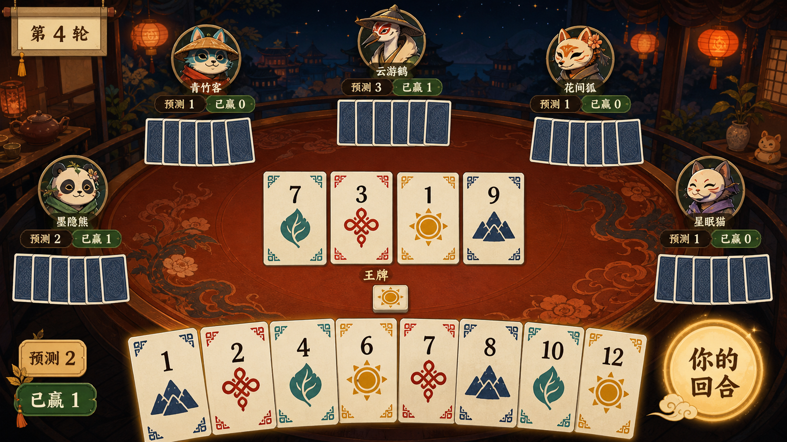

# 美术方向与资源清单

## 已选方向

选择视觉探索中的第二套方案：“奇术茶馆 / Enchanted Teahouse”。唯一布局与风格基准为：

## 设计语言

- **气质**：温暖、友好、带一点神秘感，像朋友深夜围桌玩的奇术纸牌；避免阴森、厚重或竞技电竞化。
- **场景**：夜色茶馆、漆木圆桌、纸灯笼、远景楼阁、克制的水墨云气。
- **材质**：宣纸卡面、深色漆木、旧金描边、棉麻与陶器点缀。
- **颜色**：夜蓝背景、朱漆桌面、米白纸张、暖金光源；四色牌使用靛蓝、朱红、青绿和赭黄。
- **角色**：原创动物与面具旅人，造型友善、轮廓差异明显，不使用现有动漫或民俗 IP 角色。
- **动效**：轻快翻牌、纸张滑动、灯笼微晃、获墩时短促金光；不使用持续强粒子或刺眼闪烁。

## 四种花色

| 花色 | 颜色 | 符号 | 识别原则 |
| --- | --- | --- | --- |
| 山 | 靛蓝 | 双峰山形 | 稳定、尖锐外轮廓 |
| 结 | 朱红 | 连环绳结 | 中心对称、线条密集 |
| 叶 | 青绿 | 单片弯叶 | 柔和、明显方向性 |
| 日 | 赭黄 | 圆日与短芒 | 圆形、辐射轮廓 |

花色必须通过颜色、符号和卡角纹样三重区分，以支持弱色觉玩家。

## 正式资源清单

美术资源已通过最终验收并保存在 [`art/`](../art/README.md)。运行时语义键、路径、锚点、九宫格和压缩建议见 [`art/asset-manifest.json`](../art/asset-manifest.json)。

### 牌桌与环境

- 1920×1080 横版夜间茶馆背景；
- 朱漆圆桌主表面及六席安全交互区；
- 暖光、桌面高光与轻量氛围层；
- 王牌标记、轮次卷轴和回合提示底板。

### 卡牌

- 七张正式母版：统一卡背、四张花色母版、至高牌和虚无牌；
- 正式源尺寸 1024×1536，运行时尺寸 256×384；
- 数字牌由四张花色母版与界面层数字 1–13 组合；
- 支持合法、不可出、选中、悬停和已打出状态；
- 卡背、结牌、至高牌已完成局部返修；返修结果已收敛回稳定母版文件名，清单不再引用临时 `v2` 文件。

数字和花色符号由界面层组合，避免为 52 张数字牌分别导出重复大图。

### 角色

- 6 名角色：青竹客、云游鹤、花间狐、墨隐熊、星眠猫和面具旅人；
- 每名角色包含常态、思考、得意、失误四种表情，共 24 张独立头像；
- 正式源尺寸 1024×1024，运行时尺寸 512×512，目标显示尺寸 160×160；
- 四象限母版的中央分隔线已从所有独立裁切中移除；
- 允许思考表情使用轻微托腮或头部姿态，但身份、服饰、金框、暗蓝底、尺度和光照必须稳定。

### 教程资源

- 规则提示插图：源文件 1536×1024，运行时 768×512；
- `bid-tap`、`card-drag`、`play-confirm` 三组手势动画；
- 每组 4 帧透明 PNG，单帧 256×256；
- `card-drag` 使用一致手势位移动画：同一手势造型每帧固定平移 `(+33, -8)` 像素，形成匀速向右上拖动；实现时不得额外改变帧锚点、缩放或旋转。

### 控件与反馈

- 主按钮、次按钮、危险操作、禁用状态；
- 预测值选择器、王牌选择器、计分条、托管与断线标记；
- 合法牌光圈、选中光圈、赢墩反馈、预测命中/失败和重连反馈；
- 面板、卷轴、状态牌和计分带使用九宫格；圆形按钮、头像框和光效保持等比缩放。

## Cocos Creator 3.8 导入约定

### 语义资源键

- 使用 `domain.category.name[.state]` 命名，例如 `card.face.mountain`、`avatar.bambooCat.thinking`、`tutorial.gesture.cardDrag`；
- 业务代码只请求语义键，不从文件名、目录名或 SpriteFrame 顺序推导规则；
- 表情状态固定为 `normal`、`thinking`、`proud`、`mistake`。

### 锚点与动画

- 卡牌、头像、教程插图、UI 和手势帧默认锚点为 `(0.5, 0.5)`；
- 手势帧关闭 trim，四帧使用同一尺寸和同一锚点；
- `card-drag` 直接播放已有透明帧中的一致位移，不在代码层叠加逐帧偏移；若改为单图节点动画，也必须保持线性 `(+33, -8)` 每帧位移。

### 九宫格与图集

- 自动图集建议最大 2048×2048、padding 4 px、extrude 2 px、禁止旋转；
- `primaryPanel`、`secondaryPanel`、`smallPlaque`、`greenStatus`、`scoreRibbon` 和 `roundTitleScroll` 使用清单中的九宫格 inset；
- 圆形按钮、倒计时环、徽章、头像、卡牌和 FX 不使用九宫格；
- 避免自动 trim 透明手势和 FX，以免锚点或外发光边缘跳动。

### 纹理压缩

- 卡牌、头像和规则插图优先 ASTC 6×6，背景可用 ASTC 8×8；
- 透明 UI、FX 与教程手势优先 ASTC 4×4；
- 不支持 ASTC 的设备回退 ETC2 RGB/RGBA；边缘质量仍不合格时回退 RGBA8888；
- 2D 界面默认关闭 mipmap，使用 linear 过滤；禁止压缩导致卡角符号、头像眼神或手指轮廓不可辨。

## 已完成界面

- 首页：`art/mockups/home-screen.png`；
- 好友房：`art/mockups/friend-room-screen.png`；
- 游戏牌桌：`art/mockups/gameplay-screen.png`；
- 轮次结算：`art/mockups/round-results-screen.png`。

这四张稿覆盖首版最重要的体验闭环，编码以它们作为同级视觉真值，不再从文字描述重新推断布局。

## 版权边界

- 原始照片只用于理解玩法；
- 不复制 Wizard/巫师牌标题、W/J 字母、四色符文、封面构图、厂商标识或既有卡面；
- 所有最终角色、符号、背景和文案必须保存生成记录或源文件，便于确认权属与后续修改。
