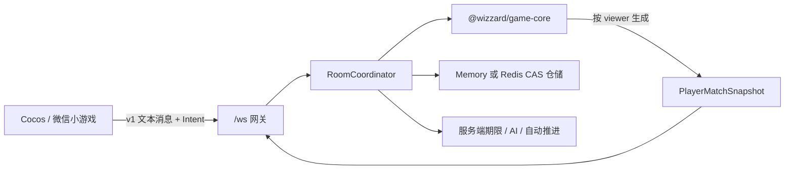
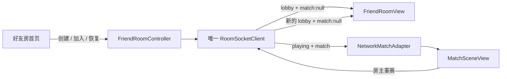

# WebSocket 好友房服务

状态：**服务端与 Cocos 好友房大厅均已实现本地可运行版本**。当前范围是 3–6 席好友房、AI 补位、断线恢复和完整权威牌局；公共匹配、聊天、商业化与长期账号系统不在本阶段。

## 运行边界



- 客户端永远不上传 `playerId`；一个 Socket 只绑定一个服务端签发的会话。
- `match.intent.requestId` 必须等于 `intent.commandId`。进入核心前会转换成 `sessionId:commandId`，避免不同玩家使用相同裸 ID 命中同一缓存。
- 每个连接有独立 `streamId` 和单调递增 `updateId`。每次更新同时携带该 viewer 的完整私有快照、公开事件、服务端时间与截止时间。
- AI、真人超时托管、赢墩展示结束和跨轮推进都由服务端执行；客户端倒计时归零后只能等待。
- 房间聚合只保存可序列化数据。Socket、Cocos 节点和平台对象不会进入仓储。

## 已实现的房间流程

1. 房主创建大厅并得到房间码、邀请令牌与恢复令牌。
2. 好友使用房间码或高熵邀请令牌加入；服务端分配稳定席位与身份。
3. 所有真人准备后，房主选择是否用 AI 补满配置席位并开始。
4. 服务端通过 `@wizzard/game-core` 校验每次叫墩、选王牌和出牌 Intent。
5. `trick-result` 在约 1.5 秒后推进；`round-score` 在约 8 秒后推进，也允许真人提前继续。
6. 真人行动默认 30 秒；连续两次超时后转为 AI 托管。恢复连接会轮换恢复令牌并收回真人控制。
7. 比赛中离开不会删除核心席位，而是交给 AI；大厅离开会释放席位并在需要时转移房主。

## Cocos 客户端生命周期



- `FriendRoomController` 独立于 `cc`，负责输入规范化、入口绑定、准备/开始命令、pending、连接状态和错误；它不执行或复制比赛规则。
- 首页、大厅、联网牌桌和重赛返回始终复用同一个 `RoomSocketClient`。`NetworkMatchAdapter` 在此流程中不拥有 Socket，销毁比赛视图不会销毁房间会话。
- `GameBootstrap` 在 microtask 中根据最新房间快照切换视图，避免在 Socket 同步派发过程中增删监听器而重复消费开局快照。
- 比赛期间控制器仍订阅房间更新，因此 `room.rematch` 产生的 `match:null` 不会被比赛适配器忽略后丢失。

## 协议与安全

- 协议包：`packages/room-protocol`，当前 `PROTOCOL_VERSION = 1`。
- 未知字段、错误版本、二进制帧和超过 16 KiB 的帧都会被拒绝。
- `resumeToken` 轮换保存，房间只存 SHA-256 哈希；邀请令牌同样只保存哈希。
- 服务端 RNG 为可序列化的 HMAC-SHA256 counter，32-byte key 与 counter 随房间一次 CAS 保存，不使用可预测 LCG。
- Redis 更新通过 Lua 完成 revision CAS、房间码/邀请索引和 TTL 的原子维护。
- 对外投影显式构造；禁止把 `AuthoritativeMatchState` 展开后再在客户端隐藏字段。

当前运行拓扑是单活动服务实例。Redis 已解决服务重启后玩家重连时的房间恢复与原子更新，但横向扩容前仍需增加房间 lease 和 Redis pub/sub，确保每个截止时间只有一个执行者、不同实例上的 Socket 能收到同一次广播。

## 本地环境

Node.js 22 是当前验证环境。`npm install` 后，根脚本 `npm run room:dev` 会启动内存版服务；`GET /healthz` 用于存活检查，WebSocket 地址为 `ws://127.0.0.1:8787/ws`。

需要验证重启恢复时，可用仓库根目录的 `compose.yaml` 启动 Redis，并在启动服务的终端设置：

```powershell
$env:WIZZARD_REDIS_URL = "redis://127.0.0.1:6379"
npm run room:dev
```

端口可通过 `WIZZARD_ROOM_PORT` 修改；生产入口用逗号分隔的 `WIZZARD_ALLOWED_ORIGINS` 配置 Origin 白名单。正式小游戏通过 AppID 直属微信云托管的 `wx.cloud.connectContainer` 访问 `/ws`，无需暴露或登记公网 `wss://`；本地 `ws://` 仍只用于桌面联调。启用 Origin 白名单前必须先从真机私有协议连接中取得实际 Header，不能猜测。

## Cocos 人工联调路径

当前机器已安装 Cocos Creator 3.8.8，工程完成首次导入，并已成功生成 `cocos-client/build/web-desktop/` 与横屏 `cocos-client/build/wechatgame/` release 产物。在仓库根先准备共享包和资源：

```powershell
npm install
npm run cocos:prepare
```

终端 A 启动本地权威服务：

```powershell
npm run room:dev
```

再通过 Cocos Dashboard 使用 Creator 3.8.8 打开仓库中的 `cocos-client/` 工程。

打开 `assets/scenes/Boot.scene` 后使用浏览器预览。单端最短冒烟路径是“创建 3 人快速局 → 房主准备 → 保持 AI 补位开启 → 开始游戏”。完整好友联调使用两个隔离的浏览器存储环境，例如普通窗口加无痕窗口：

1. A 创建 3 人快速局并复制 6 位房间码；B 输入另一个昵称并用该房间码加入。
2. A、B 都点击准备；A 保持 AI 补位开启并点击开始。
3. 两端应自动从大厅进入联网 `MatchSceneView`，看到相同公开状态但只看到自己的私有手牌和合法牌。
4. 轮流完成选择王牌、叫墩和出牌；等待倒计时归零时，客户端不得自行推进，随后应收到服务端托管结果。
5. 用浏览器网络面板短暂离线再恢复；应先显示重连状态，随后恢复同一玩家、同一私有手牌和最新版本。
6. 完成快速局后由房主请求重赛；两端应返回原房间大厅，房间码不变且不会额外创建 Socket。

同一普通浏览器中的两个标签页会共享 `localStorage`，可能互相覆盖恢复令牌，因此不用于可靠的双玩家恢复测试。若要验证服务重启后的恢复，先启用 Redis，再重启房间服务。

## 原始协议联调路径

需要排查客户端视图之外的问题时，仍可用两个通用 WebSocket 客户端（例如 Apifox/Postman）连接 `ws://127.0.0.1:8787/ws`：

1. A 发送 `{"v":1,"type":"room.create","requestId":"host-create","payload":{"avatarKey":"bamboo-cat","displayName":"房主","maxPlayers":3,"mode":"quick"}}`，保存 `session.established` 中的房间码和恢复令牌。
2. B 用房间码发送 `room.join`；A、B 分别发送 `room.set-ready`，其中 `payload` 为 `{"ready":true}`。
3. A 发送 `room.start`，其中 `payload` 为 `{"fillWithAi":true}`。两端应收到同一公开版本，但 `privateState.hand` 只能是各自手牌。
4. 依据当前端快照的 `currentPlayerId`、`version` 和合法牌发送 `match.intent`；`requestId` 必须与 `intent.commandId` 相同。
5. 关闭 B 后重新连接并发送 `session.resume`；应恢复相同玩家、相同私有手牌与最新版本，同时得到轮换后的恢复令牌。
6. 在行动阶段等待截止时间，过期 Intent 应被拒绝，随后两端应收到服务端托管动作；一墩和一轮也应分别由服务端自动推进。

最小自动验证使用真实 TCP/WebSocket 覆盖协议冒充拒绝、相同裸 command ID 隔离、私有字段不可见、恢复令牌轮换、三客户端完成首轮和到期托管推进。Cocos 控制器测试另覆盖输入规范化、同类命令防重复、ack/error 清理和单 Socket 跨大厅/比赛保留。微信云托管私有 HTTP `/healthz` 已验证，本地正式构建也已通过 `resources` 分包与 4 MiB 主包/30 MiB 总包自动门槛；尚待人工完成的是微信开发者工具包体分析、小游戏视觉 QA，以及 `connectContainer` 双真机 WebSocket 与弱网恢复闭环。浏览器联调只能用于辅助诊断。
